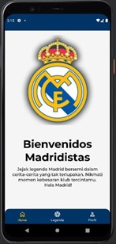

# Real Madrid App

**Real Madrid App** is an Android application developed using **Android Studio** and **Kotlin**. The app offers an immersive experience for football fans by showcasing legendary players from **Real Madrid** through a user-friendly interface with multiple fragments.

The app features three main sections:
- **Home**: A welcoming screen for users.
- **Legend**: A list of legendary Real Madrid players, displayed using **RecyclerView**, with detailed profiles accessible on click.
- **Profile**: A personal introduction to the app creator.

[Download the app on Android!](#)

---

## Key Features

- **User-Friendly Interface**: Seamless navigation across fragments (Home, Legend, Profile).
- **Dynamic Player Profiles**: A clickable list of Real Madrid legends, each leading to a detailed player profile.
- **Personal Profile**: A section introducing you as the developer of the app.
- **Modern UI Design**: A clean, contemporary design built to be mobile-friendly.

---

## App Preview

Here’s a preview of the app’s user interface:



---

## How to Install and Run

1. **Clone the repository**:
   ```bash
   git clone https://github.com/ikhsannovianto/Real-Madrid-App.git

---

## License

This project is licensed under the **MIT License**. You can freely use, modify, and distribute it, but please refer to the [LICENSE](LICENSE) file for the full terms and conditions.

---

### Contact

Feel free to reach out if you have any questions or suggestions:

- Email: ikhsanarin9@gmail.com
- GitHub: [ikhsannovianto](https://github.com/ikhsannovianto)

---

> **Note**: Please ensure you have **Android Studio** set up and all necessary SDKs installed to run the project.
